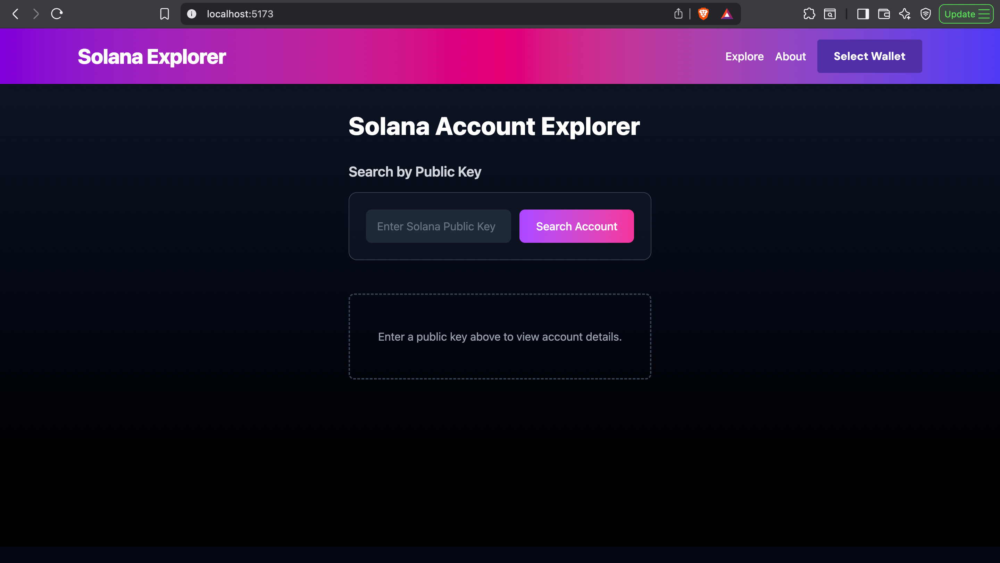
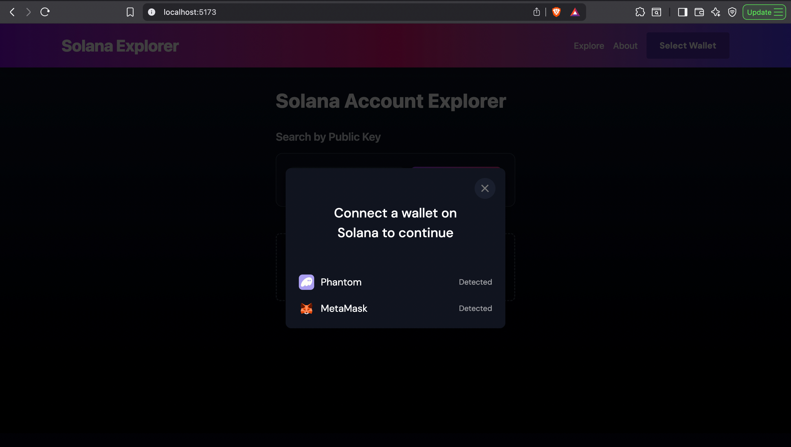
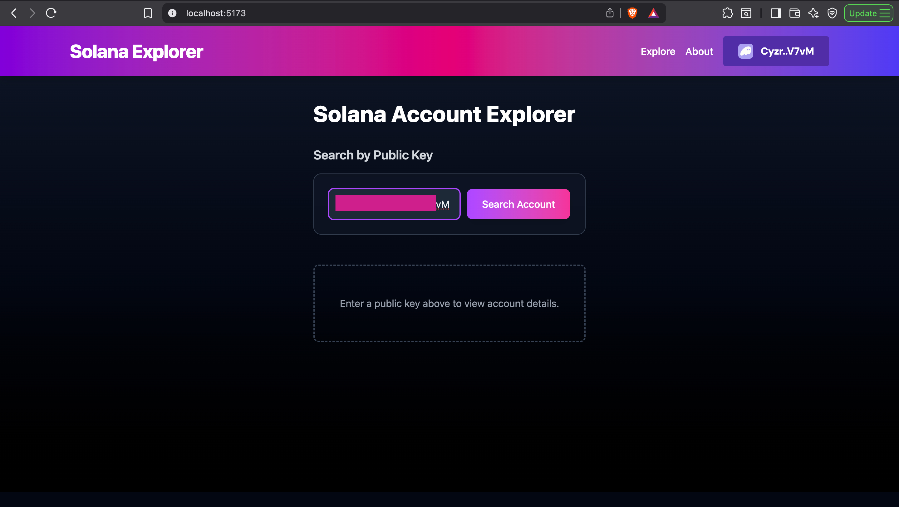
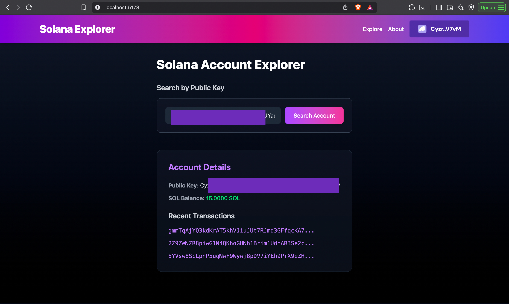

# Solana Devnet Explorer

A personal project for exploring Solana accounts, transactions, and balances on the **Devnet**.  
Built as a developer-focused tool to visualize blockchain data and experiment with Solana in a safe test environment.

---

## Project Highlights

- Inspect Solana Devnet accounts and SOL balances  
- View token holdings and transaction history  
- Clean, minimal UI for easy navigation  
- Built for **learning and experimentation**—not for production  

---

### Screenshots

**Home Screen**  

**Wallet Choice**  

**Wallet Connected**  

**Output Screen**  

## Stack

- **Solana Web3.js** – Blockchain interactions  
- **React.js** – Frontend interface  
- **Tailwind CSS** – Styling  
- **@solana/wallet-adapter** – Optional wallet integration  
- **Vite** – Development environment  

---

> ⚠️ This project is for personal development and educational purposes only. It is not intended for public use or deployment.
